# System Design Document — JobPilot AI

> Version 1.0 | July 2026

---

## Table of Contents

1. [High-Level Architecture](#1-high-level-architecture)
2. [C4 Model Diagrams](#2-c4-model-diagrams)
3. [Database Design](#3-database-design)
4. [GraphQL Architecture](#4-graphql-architecture)
5. [Event Flows](#5-event-flows)
6. [Authentication Flow](#6-authentication-flow)
7. [AWS Infrastructure](#7-aws-infrastructure)
8. [Scalability Considerations](#8-scalability-considerations)
9. [Security Considerations](#9-security-considerations)

---

## 1. High-Level Architecture

### 1.1 Architecture Style

JobPilot AI uses a **modular monolith** architecture deployed on AWS ECS Fargate with horizontal scaling capabilities. The system is designed to start as a monolith for rapid iteration and split into microservices when specific services (AI processing, analytics) require independent scaling.

```
┌─────────────────────────────────────────────────────────────────────┐
│                         CloudFront CDN                              │
├─────────────────────────────────────────────────────────────────────┤
│                    Application Load Balancer                        │
├─────────────────────────────────────────────────────────────────────┤
│                      ECS Fargate Cluster                           │
│  ┌─────────────────────┐  ┌─────────────────────────────────────┐  │
│  │   Next.js Frontend  │  │       NestJS Backend API            │  │
│  │  (apps/web)         │──│  (apps/api)                         │  │
│  │  SSR + RSC + API    │  │  GraphQL + REST + WebSocket         │  │
│  └─────────────────────┘  └──────────┬──────────────────────────┘  │
│                                       │                             │
└───────────────────────────────────────┼─────────────────────────────┘
                                        │
                    ┌───────────────────┼───────────────────┐
                    │                   │                   │
               ┌────▼────┐       ┌──────▼──────┐     ┌─────▼─────┐
               │PostgreSQL│       │   ElastiCache│    │   S3      │
               │  RDS     │       │   (Redis)    │    │ (Resumes  │
               │ Aurora   │       │   Sessions   │    │  Docs)    │
               └──────────┘       │   Cache/Queue│    └───────────┘
                                  └──────────────┘
                                        │
                                   ┌────▼────┐
                                   │ OpenAI  │
                                   │   API   │
                                   └─────────┘
```

### 1.2 Technology Stack

| Layer | Technology | Purpose |
|-------|-----------|---------|
| **Frontend** | Next.js 15, React 19, TypeScript | SSR, RSC, SEO |
| **UI** | TailwindCSS, Shadcn UI, Radix UI | Styling, accessible components |
| **State/Data** | TanStack Query, Zustand, GraphQL | Server state, client state, API |
| **Charts** | Recharts | Analytics dashboards |
| **Backend** | NestJS 11, TypeScript | GraphQL + REST API |
| **API** | Apollo Server (GraphQL) | Flexible client queries |
| **ORM** | Prisma 6 | Type-safe database access |
| **DB** | PostgreSQL 16 (Aurora) | Primary data store |
| **Cache** | Redis 7 (ElastiCache) | Sessions, rate limiting, cache |
| **AI** | OpenAI SDK (GPT-4o) | Cover letters, interviews, skills |
| **Storage** | AWS S3 | Resume uploads, documents |
| **Auth** | JWT + Passport.js | Stateless authentication |
| **Infra** | AWS ECS Fargate + Terraform | Container orchestration |
| **CI/CD** | GitHub Actions | Build, test, deploy |
| **Monitoring** | CloudWatch, Sentry | Logs, errors, metrics |

### 1.3 Communication Patterns

| Pattern | Protocol | Use Case |
|---------|----------|----------|
| **GraphQL** | HTTP/2 | Frontend ↔ Backend data queries |
| **REST** | HTTP/2 | File uploads, webhooks |
| **SSE/WS** | WebSocket | Real-time interview prep, AI streaming |
| **Internal** | In-process | Modular monolith module communication |

---

## 2. C4 Model Diagrams

### 2.1 Context Diagram (C1)

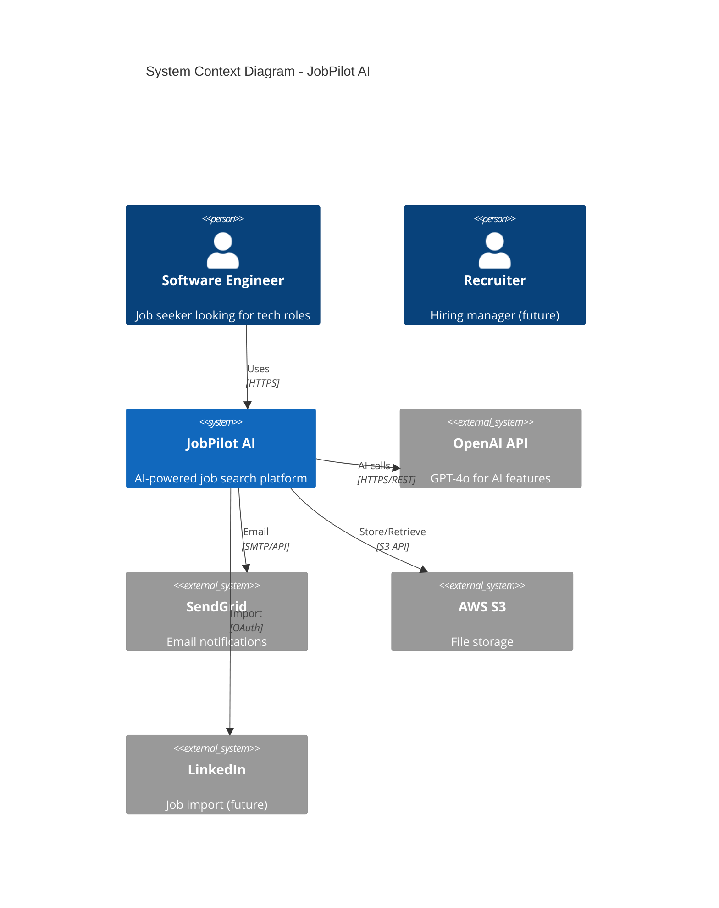

### 2.2 Container Diagram (C2)

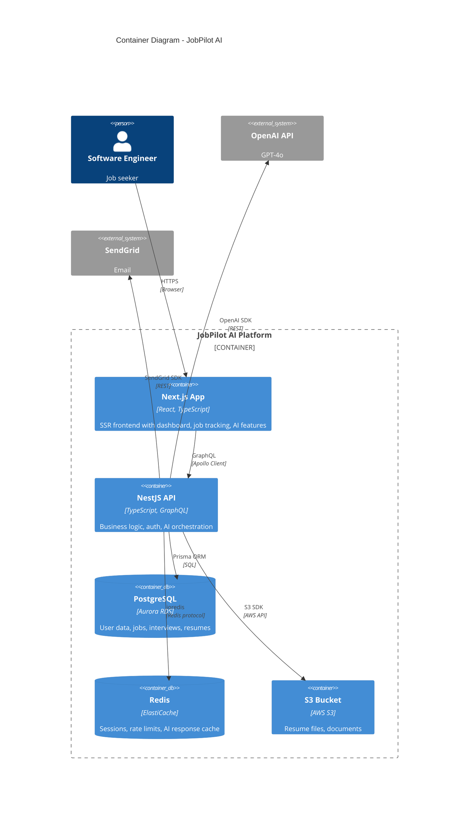

### 2.3 Component Diagram (C3)

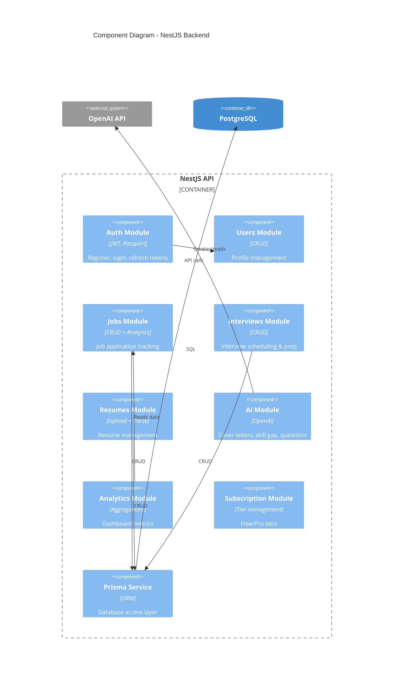

### 2.4 Sequence Diagram — Job Application Flow

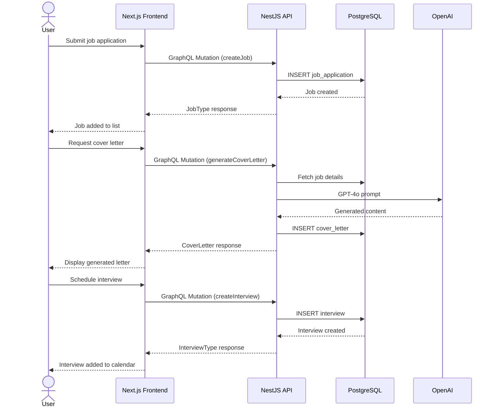

---

## 3. Database Design

### 3.1 Entity Relationship Diagram

```mermaid
erDiagram
    User ||--o{ JobApplication : has
    User ||--o{ Resume : has
    User ||--o{ CoverLetter : has
    User ||--o{ InterviewQuestion : has
    User ||--o{ SkillGapReport : has
    User ||--|| Subscription : has

    JobApplication ||--o{ Interview : has
    JobApplication ||--o{ ApplicationEvent : has

    %% User entity has a subscription
    %% Each user can have many job applications, resumes, cover letters, etc.

    User {
        string id PK
        string email UK
        string passwordHash
        string firstName
        string lastName
        string title "nullable"
        string targetRole "nullable"
        string experienceLevel "nullable"
        string targetLocations "nullable"
        string summary "nullable"
        string avatarUrl "nullable"
        boolean isActive
        datetime createdAt
        datetime updatedAt
    }

    Subscription {
        string id PK
        enum tier "FREE | PRO"
        string stripeCustomerId "nullable"
        string stripeSubscriptionId "nullable"
        datetime currentPeriodStart "nullable"
        datetime currentPeriodEnd "nullable"
        datetime canceledAt "nullable"
        string userId FK UK
    }

    JobApplication {
        string id PK
        string companyName
        string companyWebsite "nullable"
        string companyLogo "nullable"
        string jobTitle
        string jobUrl "nullable"
        string jobDescription "nullable"
        string location "nullable"
        string salaryRange "nullable"
        int salaryMin "nullable"
        int salaryMax "nullable"
        string currency "default CAD"
        string employmentType "nullable"
        string workMode "nullable"
        enum status "JobStatus"
        enum source "ApplicationSource"
        string notes "nullable"
        datetime appliedAt "nullable"
        datetime rejectedAt "nullable"
        string rejectionReason "nullable"
        int offerSalary "nullable"
        string offerEquity "nullable"
        string offerBenefits "nullable"
        datetime offerDeadline "nullable"
        datetime offerAcceptedAt "nullable"
        int rating "nullable"
        string userId FK
        datetime createdAt
        datetime updatedAt
    }

    Interview {
        string id PK
        enum type "InterviewType"
        int round "default 1"
        datetime scheduledAt "nullable"
        int durationMinutes "nullable"
        string interviewers "nullable"
        string location "nullable"
        string notes "nullable"
        string feedback "nullable"
        int rating "nullable"
        boolean isCompleted "default false"
        string jobApplicationId FK
        datetime createdAt
        datetime updatedAt
    }

    ApplicationEvent {
        string id PK
        string eventType
        string description "nullable"
        json metadata "nullable"
        string jobApplicationId FK
        datetime createdAt
    }

    Resume {
        string id PK
        string title
        string fileUrl
        string fileKey
        int fileSize "nullable"
        string mimeType "nullable"
        boolean isPrimary "default false"
        string parsedSkills "nullable"
        string parsedExperience "nullable"
        string parsedEducation "nullable"
        string userId FK
        datetime createdAt
        datetime updatedAt
    }

    CoverLetter {
        string id PK
        string jobTitle
        string companyName
        string content
        string tone "default professional"
        string jobDescription "nullable"
        boolean isGenerated "default true"
        string userId FK
        datetime createdAt
        datetime updatedAt
    }

    InterviewQuestion {
        string id PK
        string question
        string answer "nullable"
        enum type "QuestionType"
        string category "nullable"
        int difficulty "nullable"
        string source "nullable"
        boolean isFavorite "default false"
        string userId FK
        datetime createdAt
        datetime updatedAt
    }

    SkillGapReport {
        string id PK
        string jobDescription
        string jobTitle
        string companyName
        json requiredSkills
        json userSkills
        json missingSkills
        float matchScore
        json recommendations "nullable"
        string userId FK
        datetime createdAt
    }

    MarketSkill {
        string id PK
        string skill
        int count
        string month
        string role "nullable"
        datetime createdAt
        datetime updatedAt
        @@unique [skill, month, role]
    }

    SalaryData {
        string id PK
        string role
        string location "nullable"
        string experienceLevel "nullable"
        int salaryMin
        int salaryMax
        int salaryAvg
        string currency "default CAD"
        string source "default job_posting"
        string month
        datetime createdAt
    }
```

### 3.2 Indexing Strategy

| Table | Index | Type | Purpose |
|-------|-------|------|---------|
| `users` | `email` | B-tree (unique) | Login lookup |
| `job_applications` | `(userId, status)` | Composite B-tree | Filter by status |
| `job_applications` | `(userId, companyName)` | Composite B-tree | Search by company |
| `job_applications` | `(userId, createdAt)` | Composite B-tree | Sort by date |
| `interviews` | `(jobApplicationId)` | B-tree | Find by job |
| `application_events` | `(jobApplicationId)` | B-tree | Find by job |
| `application_events` | `(createdAt)` | B-tree | Recent activity |
| `resumes` | `(userId)` | B-tree | User's resumes |
| `cover_letters` | `(userId)` | B-tree | User's cover letters |
| `interview_questions` | `(userId, type)` | Composite B-tree | Filter by type |
| `skill_gap_reports` | `(userId)` | B-tree | User's reports |
| `market_skills` | `(month)` | B-tree | Time-based queries |
| `market_skills` | `(skill)` | B-tree | Skill lookup |
| `market_skills` | `(skill, month, role)` | Composite unique | Upsert |
| `salary_data` | `(role, location)` | Composite B-tree | Salary lookup |
| `salary_data` | `(month)` | B-tree | Time-based queries |

### 3.3 Audit Fields

All user-owned entities include:
- `createdAt: DateTime @default(now())`
- `updatedAt: DateTime @updatedAt`

Application events use an event-sourcing pattern for immutable audit trail.

### 3.4 Multi-Tenant Considerations

Currently single-tenant per user (userId foreign key on all entities). Designed for future workspace/organization model:
- Add `organizationId` to all entities
- Add `Organization` and `OrganizationMember` models
- Migrate `userId` foreign keys to support both personal and org contexts

---

## 4. GraphQL Architecture

### 4.1 Schema Design

```
src/schema.gql  (auto-generated by NestJS code-first approach)
     │
     ├── Query
     │   ├── me: UserType
     │   ├── jobs(pagination, status, search): PaginatedJobs!
     │   ├── job(id): JobType
     │   ├── funnelAnalytics: FunnelAnalytics!
     │   ├── monthlyStats(from, to): [MonthlyStat!]!
     │   └── ...
     │
     ├── Mutation
     │   ├── register(input): AuthPayload!
     │   ├── login(input): AuthPayload!
     │   ├── refreshToken(token): AuthPayload!
     │   ├── createJob(input): JobType!
     │   ├── updateJob(id, input): Boolean!
     │   ├── deleteJob(id): Boolean!
     │   ├── generateCoverLetter(input): CoverLetterType!
     │   └── ...
     │
     └── Subscription (future)
         ├── interviewPrepProgress: StreamingProgress
         └── jobStatusChanged: JobType
```

### 4.2 N+1 Prevention

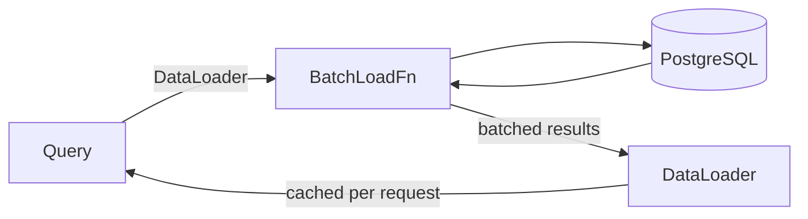

- DataLoader pattern for batching related queries
- Prisma's built-in relation loading with `include`
- Field-level selection to avoid over-fetching

### 4.3 Error Handling

```graphql
type GraphQLError {
  message: String!
  extensions: {
    code: String!         # UNAUTHENTICATED, BAD_USER_INPUT, FORBIDDEN, INTERNAL_ERROR
    originalError: {
      message: [String!]  # Validation errors
      error: String
      statusCode: Int
    }
  }
}
```

---

## 5. Event Flows

### 5.1 Application Status Change Flow

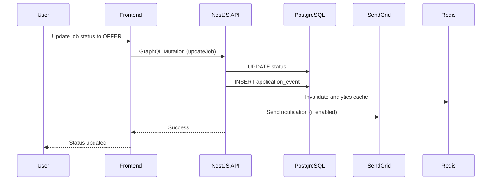

### 5.2 AI Cover Letter Generation Flow

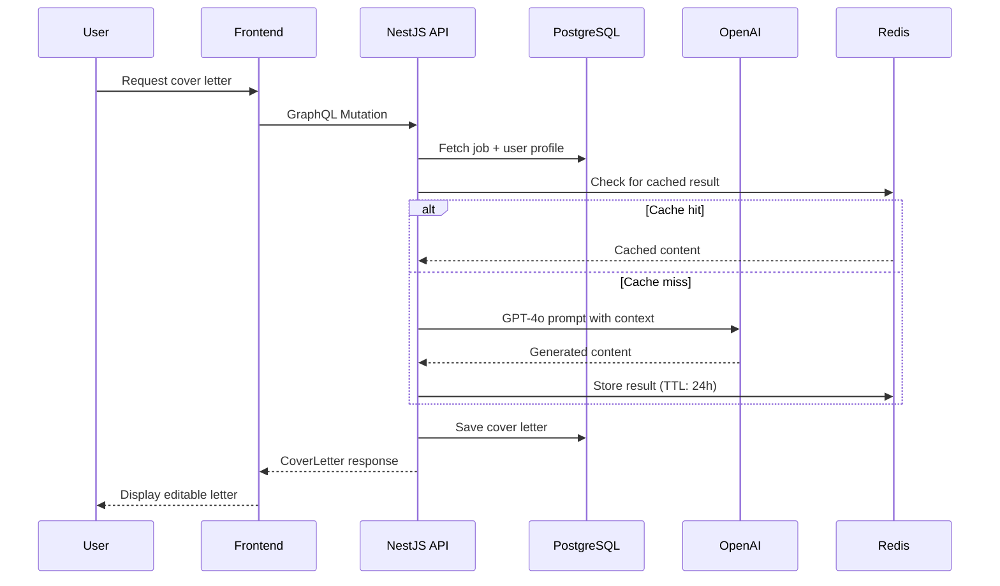

### 5.3 Analytics Aggregation Flow

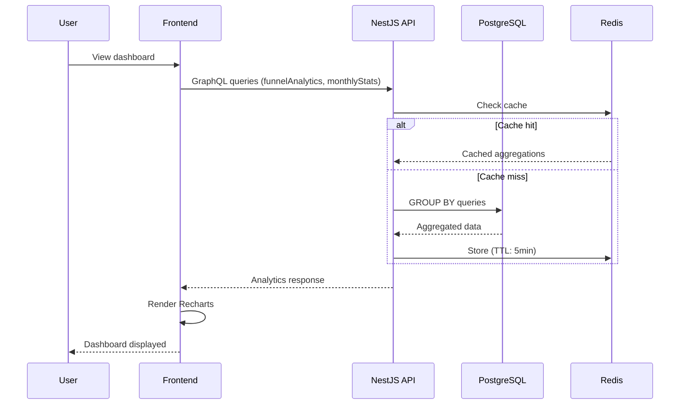

---

## 6. Authentication Flow

### 6.1 JWT-Based Auth Flow

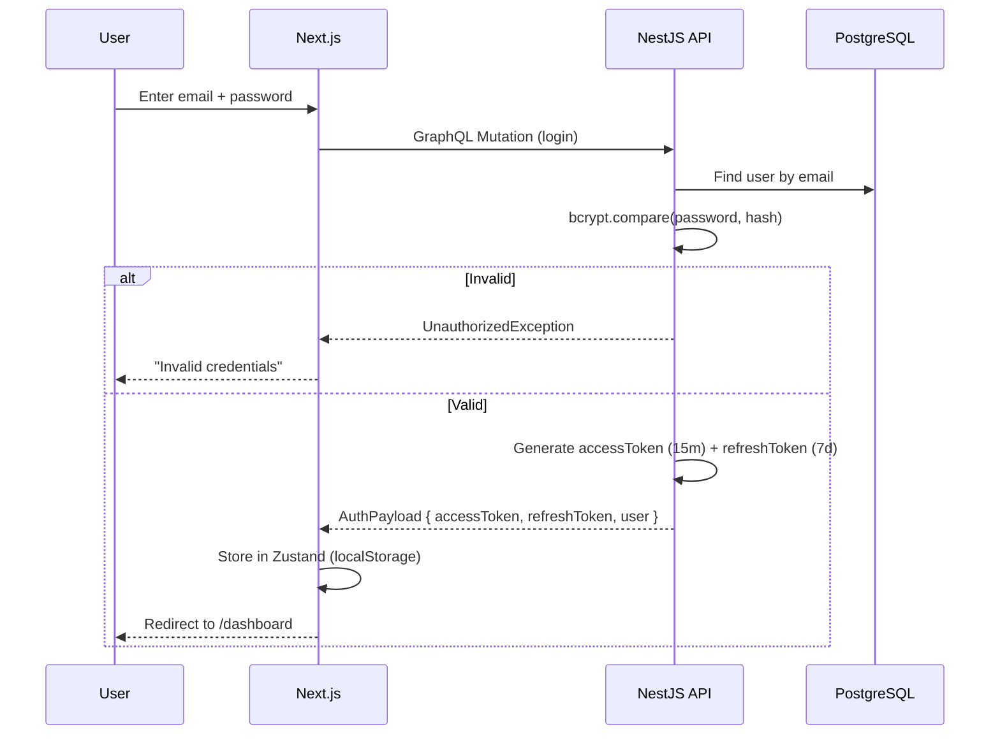

### 6.2 Token Refresh Flow

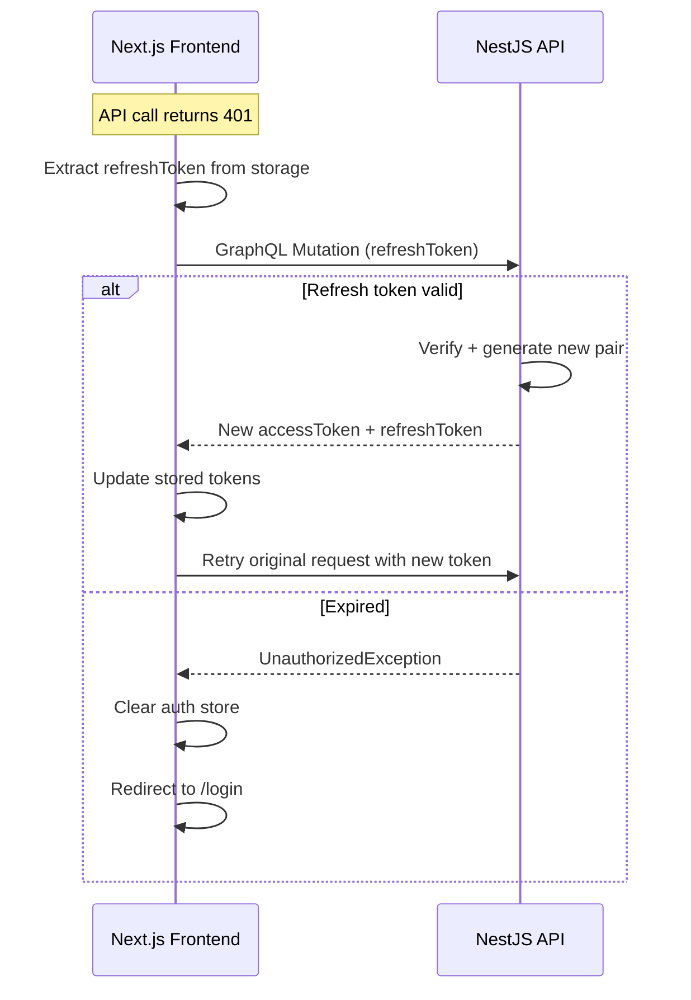

### 6.3 JWT Payload Structure

```typescript
interface AccessTokenPayload {
  sub: string;       // user.id
  email: string;     // user.email
  iat: number;       // issued at
  exp: number;       // expires (15min)
}

interface RefreshTokenPayload {
  sub: string;       // user.id
  email: string;     // user.email
  iat: number;
  exp: number;       // expires (7 days)
  tokenVersion: number;  // for revocation
}
```

### 6.4 Security Measures

| Measure | Implementation |
|---------|---------------|
| Password hashing | bcrypt, 12 rounds |
| Token expiry | Access: 15min, Refresh: 7 days |
| HTTP-only cookies | Optional for refresh token |
| Rate limiting | Per-user, per-IP on auth endpoints |
| Account lockout | After 5 failed attempts (future) |
| Refresh rotation | New refresh token on each use |
| Token revocation | `tokenVersion` field on User model |

---

## 7. AWS Infrastructure

### 7.1 Architecture Diagram

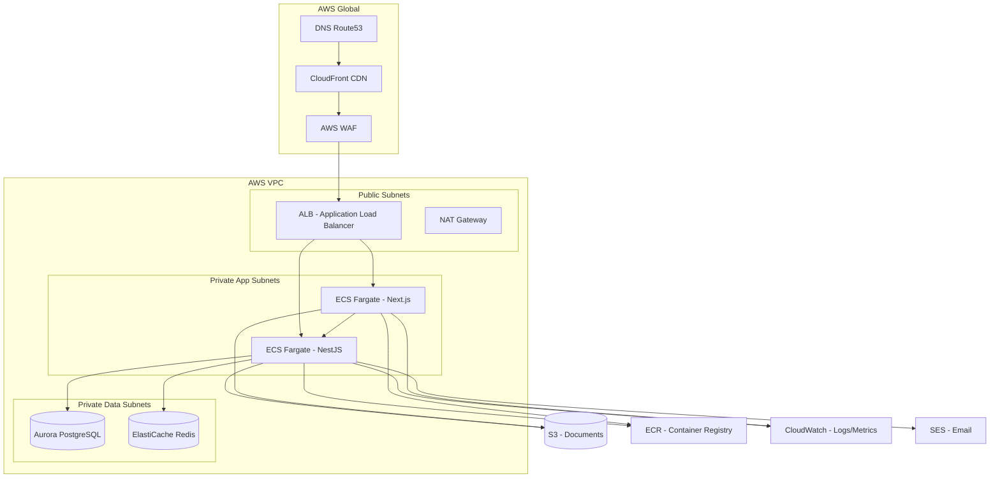

### 7.2 Infrastructure as Code (Terraform)

| Resource | Config | Purpose |
|----------|--------|---------|
| VPC | `10.0.0.0/16` | Isolated network |
| Public subnets | 2 AZs × `/24` | ALB, NAT |
| Private app subnets | 2 AZs × `/24` | ECS tasks |
| Private data subnets | 2 AZs × `/24` | RDS, Redis |
| ECS cluster | Fargate (serverless) | Container orchestration |
| ECS services | `web`, `api` | Frontend + backend |
| Task definitions | CPU/Memory config | Scaling units |
| ALB | Internet-facing | Traffic routing |
| RDS Aurora | Serverless v2 | PostgreSQL 16 |
| ElastiCache | Redis 7 (serverless) | Caching |
| S3 | 2 buckets | Uploads + logs |
| CloudFront | CDN | Static assets, caching |
| WAF | Rate limiting, IP filtering | Security |
| Route53 | DNS | Domain management |
| ECR | 2 repositories | Container images |
| CloudWatch | Log groups + dashboards | Monitoring |
| SES | Email sending | Notifications |

### 7.3 ECS Task Sizing

| Service | CPU | Memory | Min | Max | Scaling Metric |
|---------|-----|--------|-----|-----|----------------|
| Web (Next.js) | 1 vCPU | 2 GB | 2 | 6 | Request count / ALB |
| API (NestJS) | 2 vCPU | 4 GB | 2 | 8 | CPU + Memory |
| Background (future) | 1 vCPU | 2 GB | 1 | 3 | Queue depth |

### 7.4 CI/CD Pipeline

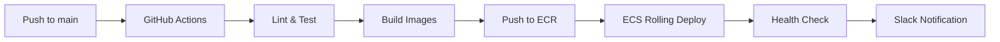

---

## 8. Scalability Considerations

### 8.1 Horizontal Scaling

| Component | Strategy | Notes |
|-----------|----------|-------|
| **Frontend** | ECS Service auto-scaling | Stateless, scales on request count |
| **Backend** | ECS Service auto-scaling | Stateless, scales on CPU/memory |
| **Database** | Aurora Serverless v2 | Auto-scales ACU (0.5–128) |
| **Redis** | ElastiCache Serverless | Auto-scales based on usage |
| **CDN** | CloudFront | Global edge caching |

### 8.2 Performance Optimizations

| Optimization | Implementation |
|-------------|---------------|
| **Response caching** | GraphQL response caching via Redis (TTL: 5s-5min) |
| **CDN caching** | Static assets (immutable, 1 year) |
| **DB query optimization** | Prisma raw queries for analytics, composite indexes |
| **N+1 prevention** | DataLoader pattern for related entities |
| **Connection pooling** | Prisma with PgBouncer-compatible settings |
| **AI response caching** | Cache generated content by hash of input |
| **Lazy loading** | Frontend code splitting by route |
| **Image optimization** | Next.js Image component with CloudFront |

### 8.3 Database Scaling

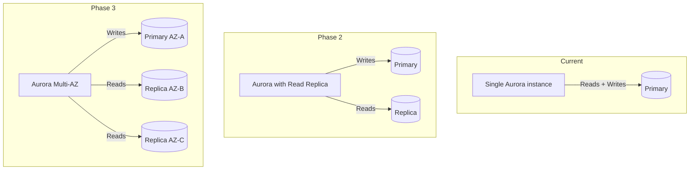

### 8.4 AI Feature Scaling

The OpenAI API is the primary external dependency. To handle latency and cost:

1. **Caching**: Generated content cached in Redis by input hash (TTL: 24h)
2. **Queuing**: Background job processing for batch AI operations
3. **Rate limiting**: Per-user rate limits on AI endpoints
4. **Streaming**: SSE for long-running generations (interviews)
5. **Fallback**: Pre-computed templates when API is unavailable

---

## 9. Security Considerations

### 9.1 Threat Model

| Threat | Impact | Mitigation |
|--------|--------|------------|
| **SQL Injection** | Data breach | Prisma ORM (parameterized queries) |
| **XSS** | Account takeover | Helmet headers, React JSX escaping, CSP |
| **CSRF** | Unauthorized actions | SameSite cookies, CSRF tokens |
| **JWT theft** | Account takeover | Short expiry (15min), refresh rotation |
| **Brute force** | Credential compromise | Rate limiting, account lockout |
| **IDOR** | Unauthorized data access | User-scoped queries (userId filter) |
| **SSTI** | RCE | No server-side templates |
| **Dependency** | Supply chain | Dependabot, `npm audit`, SCA |
| **DoS** | Service disruption | Rate limiting, WAF, auto-scaling |
| **OpenAI prompt injection** | AI misuse | Input sanitization, output filtering |

### 9.2 Security Headers

| Header | Value | Purpose |
|--------|-------|---------|
| `Content-Security-Policy` | `default-src 'self'` | XSS prevention |
| `X-Frame-Options` | `DENY` | Clickjacking |
| `X-Content-Type-Options` | `nosniff` | MIME sniffing |
| `Strict-Transport-Security` | `max-age=31536000; includeSubDomains` | HTTPS enforcement |
| `Referrer-Policy` | `strict-origin-when-cross-origin` | Referrer leakage |
| `Permissions-Policy` | `camera=(), microphone=()` | Feature restriction |

### 9.3 Data Privacy

| Data Type | Classification | Handling |
|-----------|---------------|----------|
| Email | PII | Encrypted at rest (AES-256), masked in logs |
| Password | Secret | bcrypt hashed, never logged |
| Resume content | PII | S3 server-side encryption, signed URLs |
| Job descriptions | User data | Scoped to user, deleted on account removal |
| AI generated content | User data | Stored per user, TTL-based cache |
| Analytics | Aggregated | Anonymized, no PII in metrics |

### 9.4 Compliance Roadmap

| Requirement | Status | Notes |
|------------|--------|-------|
| GDPR | Planned | Data export, right to deletion |
| SOC 2 | Future | Audit logging, access controls |
| PIPEDA | Planned | Canadian privacy compliance |
| WCAG 2.1 AA | MVP | Accessibility-first design |

---

## Appendix A: Key Design Decisions

| Decision | Option Chosen | Alternatives | Rationale |
|----------|--------------|--------------|-----------|
| API paradigm | GraphQL | REST, tRPC | Flexible queries, single endpoint, introspection |
| ORM | Prisma | TypeORM, Drizzle, Knex | Type safety, migration DX, ecosystem |
| Frontend framework | Next.js | Remix, SPA | SSR, RSC, SEO, file-based routing |
| CSS approach | Tailwind | CSS modules, styled-components | Utility-first, design system, bundle size |
| Auth | JWT | Sessions, OAuth | Stateless, API-friendly, simple deployment |
| Deployment | ECS Fargate | Lambda, EKS, Render | Predictable perf, no cluster management |
| Infra-as-Code | Terraform | Pulumi, CDK | Cloud-agnostic, mature ecosystem |
| Monorepo | Turborepo | Nx, Lerna | Simple, fast, Vercel integration |

## Appendix B: Monitoring & Observability

| Metric | Tool | Alert Threshold |
|--------|------|----------------|
| API p95 latency | CloudWatch | > 500ms |
| Error rate | Sentry | > 1% |
| CPU utilization | CloudWatch | > 80% for 5min |
| Memory utilization | CloudWatch | > 85% for 5min |
| AI API latency | Custom metric | > 10s |
| Database connections | CloudWatch | > 80% of max |
| Failed logins (per user) | Custom metric | > 5 in 15min |
| 5xx errors | CloudWatch + Sentry | Any |
